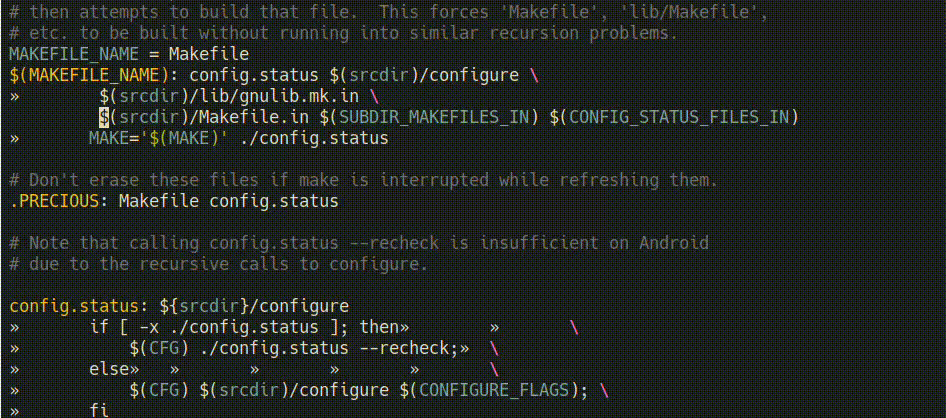

## Makefile variable expansion using macrostep

Expands make variables using macrostep-expand interface from [macrostep](https://github.com/emacsorphanage/macrostep).

Variables are retrieved from make's internal database using `make -prns`. They
are updated when the buffer's file's modication time changes.

The following functions are defined for the macrostep interface:

	+ macrostep-sexp-bounds-function
	+ macrostep-sexp-at-point-function
	+ macrostep-environment-at-point-function
	+ macrostep-expand-1-function
	+ macrostep-print-function

### Usage

Require `macrostep` and `macrostep-make`.

Bind `macrostep-expand` to a key, eg `(kbd C-c e)`.

Then, in makefiles, <kbd>C-c e</kbd> interactively expands variables at point.

